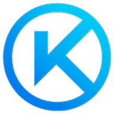

<div align="center">



# <span style="color:#00f0ff;">KRYLS</span> <span style="color:#bd00ff;">•</span>

### Automated Non-Custodial Escrow for Digital Services

**A deterministic settlement protocol for clients and service providers — built for EVM networks.**

<br/>

<a href="https://kryls.com">

</a>
<a href="https://github.com/kryls">

</a>

<br/><br/>


</div>

---

<div align="center">

> **Work can be coordinated off-chain.**
> **Settlement can be enforced on-chain.**

</div>

---

## ◈ What is KRYLS?

**KRYLS is a non-custodial escrow protocol designed for digital services.**

It provides the financial infrastructure required to move a digital engagement from:

`Agreement` → `Funding` → `Execution` → `Approval` → `Settlement`

without requiring a centralized intermediary to control the escrowed funds.

### Core Principles

|   | Principle         | Description                                                              |
| - | ----------------- | ------------------------------------------------------------------------ |
| ◈ | **Non-Custodial** | Funds are governed by protocol logic rather than a centralized platform. |
| ◆ | **Deterministic** | Settlement follows predefined rules and state transitions.               |
| ◇ | **Auditable**     | Important financial transitions can be verified on-chain.                |
| ✦ | **State-Driven**  | Every project follows an explicit lifecycle.                             |

---

# ⚡ Why KRYLS?

Traditional freelancing platforms place a large amount of trust in a centralized service.

KRYLS separates the application layer from the financial settlement layer.

```text
                 KRYLS
                   │
        ┌──────────┴──────────┐
        │                     │
   APPLICATION             PROTOCOL
        │                     │
   Projects              Escrow
   Profiles              Settlement
   Chat                  Disputes
   Marketplace           Governance
        │                     │
        └──────────┬──────────┘
                   │
                EVM
```

The application coordinates the relationship.

The protocol enforces the financial rules.

---

# ◇ How It Works

### `01` Create

A client creates a digital-service project with its requirements, budget, asset, and engagement model.

↓

### `02` Connect

Freelancers discover projects and submit applications.

↓

### `03` Agree

The parties communicate, negotiate terms, and establish the conditions of the engagement.

↓

### `04` Fund

The client commits the required funds to the on-chain escrow.

↓

### `05` Execute

The freelancer performs the work and submits the result.

↓

### `06` Settle

Once the required conditions are satisfied, the protocol executes the corresponding settlement.

↓

### `07` Resolve

If something goes wrong, the project can enter a structured dispute lifecycle instead of allowing unrestricted movement of funds.

---

# 💠 Engagement Models

KRYLS is designed to support multiple forms of digital work.

| Model               | Description                                                  |
| ------------------- | ------------------------------------------------------------ |
| 💰 **Full Payment** | One settlement after the engagement is completed.            |
| 🧩 **Milestone**    | Divide a project into multiple independently settled stages. |
| ⏱️ **Hourly**       | Support time-based digital-service engagements.              |

This allows the protocol to accommodate both small one-off tasks and larger multi-stage projects.

---

# 🔐 Non-Custodial Architecture

The core philosophy of KRYLS is simple:

> **The platform should coordinate the work — not own the money.**

Critical financial operations are represented by explicit protocol logic.

```text
Client
  │
  │ Fund
  ▼
┌───────────────────────┐
│     KRYLS ESCROW      │
│                       │
│  State Machine        │
│  Accounting           │
│  Settlement           │
│  Disputes             │
│  Emergency Controls   │
└───────────┬───────────┘
            │
            │ Settlement
            ▼
       Freelancer
```

---

# 🧠 Smart Contract Architecture

The escrow engine is built around several independent security boundaries.

### 💰 Financial Accounting

Tracks deposited, settled, remaining, and locked funds while preserving their relationships throughout the project lifecycle.

### 🔄 State Machine

Projects move through explicit states such as:

`Created → Funded → Active → Completed`

with additional paths for:

`Cancelled · Expired · Disputed · Resolved · Emergency Recovery`

Invalid transitions are rejected by the protocol.

### 🧱 Project Isolation

Each project is treated as an independent financial unit.

A settlement or dispute belonging to one project should not unexpectedly affect another.

### 🛡️ Access Control

Sensitive operations are separated from normal user actions through explicit authorization and governance mechanisms.

### 🚨 Emergency Controls

The architecture includes pause and recovery mechanisms for abnormal situations while protecting restricted states.

### ⚖️ Dispute Layer

Dispute handling is implemented as a dedicated subsystem with its own lifecycle, validation, and accounting boundaries.

---

# 🛡️ Security Engineering

Security is not treated as a single test.

KRYLS has been tested across multiple categories of normal, abnormal, adversarial, and high-load behavior.

### Tested Areas

```text
✓ Accounting Invariants
✓ State Transitions
✓ Project Isolation
✓ Reentrancy
✓ Malicious Callbacks
✓ Token Behavior
✓ Access Control
✓ Governance
✓ Dispute Resolution
✓ Emergency Recovery
✓ Failed External Calls
✓ Multi-Project Scenarios
✓ Stress Testing
✓ Gas Behavior
✓ Adversarial Attack Scenarios
✓ Integration Testing
```

The testing approach includes:

**unit · negative · randomized · persistence · adversarial · reentrancy · integration · recovery · stress · security**

The objective is not merely to prove that the happy path works.

It is to test whether the protocol continues to preserve its critical invariants **when the environment behaves unexpectedly**.

---

# 📊 Accounting Invariants

One of the most important properties of a financial protocol is maintaining consistency between its internal state and actual funds.

KRYLS testing focuses on relationships between:

```text
Deposited
    │
    ├──────────────► Settled
    │
    ├──────────────► Locked
    │
    └──────────────► Remaining
```

The system is tested across failures, disputes, multiple projects, reentrancy scenarios, and adversarial behavior.

The goal is simple:

> **A failed operation should not leave the financial state half-changed.**

---

# 🪙 Token Safety

KRYLS deliberately constrains the assets accepted by the escrow rather than claiming compatibility with every possible ERC-20 implementation.

Testing has considered abnormal token behaviors including:

* incorrect return values
* missing return values
* transfer failures
* transfer taxes
* rebasing behavior
* blacklist behavior
* unusual decimal configurations
* malicious token interactions

This reflects a core principle:

> **Explicit compatibility boundaries are safer than unlimited compatibility claims.**

---

# ⚖️ Dispute Resolution

Disputes are a first-class part of the KRYLS architecture.

The system is designed around a structured dispute lifecycle:

```text
Project
   │
   ▼
Dispute Created
   │
   ▼
Validation
   │
   ▼
Arbitration / Resolution
   │
   ▼
Protocol Outcome
   │
   ▼
Settlement
```

The architecture includes support for:

* dispute creation
* dispute fees
* external dispute identifiers
* project-to-dispute binding
* arbitrator validation
* resolution outcomes
* protection against repeated resolution
* dispute isolation
* preservation of locked funds

The design is also prepared for **Kleros-compatible dispute flows**.

---

# 🏛️ Governance & Emergency Response

KRYLS treats governance and emergency operations as separate security boundaries.

The architecture includes:

| Mechanism              | Purpose                             |
| ---------------------- | ----------------------------------- |
| 🔑 Access Control      | Restrict sensitive operations       |
| ⏳ Timelocks            | Make critical changes deliberate    |
| 🛑 Emergency Pause     | Stop restricted operations          |
| 🔄 Recovery            | Handle exceptional situations       |
| 🛡️ Dispute Protection | Prevent inappropriate fund recovery |

The goal is to make sensitive changes **controlled, observable, and deliberate**.

---

# ⛽ Performance & Gas

The escrow system has also been tested under high-load scenarios.

Testing has included:

* tens of thousands of repeated calls
* long-running execution
* hundreds of projects
* stress scenarios involving thousands of projects
* simultaneous settlement, cancellation, expiration, and dispute operations

### Reported Test-Environment Measurements

| Operation           | Approx. Gas |
| ------------------- | ----------: |
| Project Creation    |     `~400k` |
| Full Settlement     |     `~114k` |
| Dispute             |     `~119k` |
| Cancellation        |      `~48k` |
| Contract Deployment |       `~4M` |

> These are test-environment measurements, not guaranteed production costs. Actual network fees depend on the target chain, gas price, transaction path, and network conditions.

---

# 🌐 KRYLS Application

The protocol is surrounded by a Web3 application designed to make the underlying infrastructure usable.

### 🏠 Home

Wallet connection, onboarding, role selection, terms, and protocol information.

### 📊 Dashboard

Profiles, roles, project creation, milestone configuration, and project management.

### 🛒 Marketplace

Browse projects, search opportunities, filter results, and submit applications.

### 💬 Chat

Communication, request approval, terms negotiation, delivery submission, acceptance, and dispute initiation.

### 🔄 Swap

Optional token-swap functionality designed for Polygon.

---

# 🏗️ Architecture Overview

```text
┌────────────────────────────────────────────┐
│                KRYLS APP                   │
│                                            │
│  Home · Dashboard · Market · Chat · Swap  │
└──────────────────────┬─────────────────────┘
                       │
                       ▼
┌────────────────────────────────────────────┐
│              APPLICATION API               │
│                                            │
│  Projects · Profiles · Requests · Messages │
│  Terms · Deliveries · Application State    │
└──────────────────────┬─────────────────────┘
                       │
                       ▼
┌────────────────────────────────────────────┐
│             KRYLS ESCROW CORE              │
│                                            │
│  Accounting · State Machine · Settlement  │
│  Disputes · Governance · Recovery         │
└──────────────────────┬─────────────────────┘
                       │
                       ▼
┌────────────────────────────────────────────┐
│                 EVM                        │
│                                            │
│             Sepolia / Polygon              │
└────────────────────────────────────────────┘
```

---

# 🧰 Technology Stack

<div align="center">

| Layer                      | Technology              |
| -------------------------- | ----------------------- |
| **Frontend**               | HTML · CSS · JavaScript |
| **Backend**                | Node.js · Express       |
| **Smart Contracts**        | Solidity                |
| **Blockchain Interaction** | Ethers.js               |
| **Settlement**             | EVM                     |
| **Payment Assets**         | ERC-20                  |
| **Dispute Architecture**   | Kleros-compatible       |
| **Messaging Architecture** | XMTP-ready              |
| **Swap Infrastructure**    | ParaSwap · Polygon      |

</div>

---

# 🌍 Current Deployment

### Ethereum Sepolia

**Escrow Contract**

```text
0xFd2F7895c9D851288e8Afb3e86fb9Bd4A9153BBb
```

### Supported Test Assets

`USDT` · `USDC` · `DAI`

### Polygon

The Swap component is designed for Polygon using external liquidity infrastructure.

> Current deployments are intended for development and testing unless explicitly stated otherwise.

---

# 🧪 Testing Philosophy

KRYLS follows a layered testing philosophy.

```text
                    ┌───────────────┐
                    │ Final Security│
                    └───────┬───────┘
                            │
                 ┌──────────▼──────────┐
                 │ Integration / Stress│
                 └──────────┬──────────┘
                            │
                ┌───────────▼───────────┐
                │ Adversarial / Recovery│
                └───────────┬───────────┘
                            │
                   ┌────────▼────────┐
                   │ Negative / Fuzz │
                   └────────┬────────┘
                            │
                       ┌────▼────┐
                       │  Unit   │
                       └─────────┘
```

This layered approach is intended to test both individual functions and the behavior of the **system as a whole**.

---

# 🚀 Project Status

KRYLS has progressed beyond a basic escrow prototype.

The current project includes:

* ◈ Web3 application layer
* ◈ Wallet-based identity
* ◈ Freelancing marketplace
* ◈ Project lifecycle management
* ◈ Client / freelancer roles
* ◈ Communication layer
* ◈ On-chain escrow
* ◈ Milestone architecture
* ◈ Dispute architecture
* ◈ Governance controls
* ◈ Emergency mechanisms
* ◈ Extensive smart-contract testing

### Current Direction

**From tested protocol → toward production-ready infrastructure.**

---

# ⚠️ Security Disclaimer

The current testing results provide strong evidence that the implementation preserves its intended behavior across a broad range of tested scenarios.

However:

> **Passing tests are not a security audit.**

Testing cannot prove the absence of unknown vulnerabilities, and it does not replace:

* independent security audits
* formal verification
* production monitoring
* economic analysis
* real-world adversarial review

KRYLS therefore treats its current results as **evidence of engineering maturity and tested behavior — not a guarantee of absolute security.**

---

# 🔮 Vision

KRYLS is not simply trying to build another freelancing website.

The larger goal is to create infrastructure for **programmable digital work agreements**.

A future where the financial lifecycle of digital work can be expressed as:

```text
AGREEMENT
    ↓
FUNDING
    ↓
EXECUTION
    ↓
APPROVAL
    ↓
SETTLEMENT
```

with milestones, time conditions, disputes, and exceptional situations handled through explicit protocol rules.

---

<div align="center">

# KRYLS

### **Work can be coordinated off-chain.**

### **Settlement can be enforced on-chain.**

<br/>

<a href="https://kryls.com">

</a>

<br/><br/>

**Built for digital work.
Designed for deterministic settlement.**

</div>
